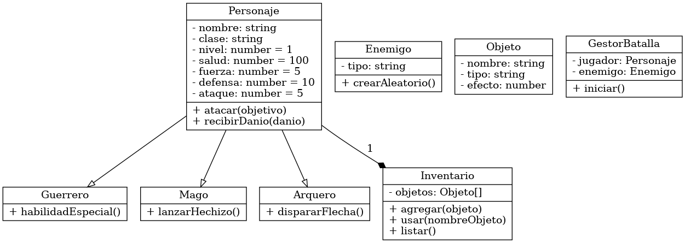

# 🛡️ Simulador de Batallas RPG por Consola - Node.js

## 🎯 Objetivo
## integrantes 
jean marlon barajas 
juan divid bermeo


Desarrollar una **aplicación de consola interactiva** que permita crear personajes, simular batallas por turnos contra enemigos controlados por IA, gestionar habilidades y objetos, aplicar los principios de programación orientada a objetos y cumplir con los principios SOLID.

---

## ⚙️ Tecnologías Usadas

- **Node.js** (JavaScript)
- [`inquirer`](https://www.npmjs.com/package/inquirer): menú interactivo por consola
- `fs/promises`: para persistencia en archivos JSON
- Diseño limpio con división en capas (`models`, `services`, `utils`)

---

## 🧠 Principios SOLID Aplicados

| Principio | Aplicación |
|----------|-------------|
| **SRP**  | Cada clase tiene una única responsabilidad: `GestorBatalla`, `Inventario`, `Personaje`, etc. |
| **OCP**  | Puedes crear nuevas clases (`Guerrero`, `Mago`, etc.) sin modificar la clase base. |
| **LSP**  | Todos los personajes derivan de una clase base común (`Personaje`). |
| **ISP**  | Las habilidades y objetos definen solo los métodos que necesitan. |
| **DIP**  | `GestorBatalla` usa abstracciones como efectos de habilidad o IA enemiga sin depender de implementaciones directas. |

---

## 🧩 Arquitectura y Organización

📁 src/
┣ 📁 models/
┃ ┣ 📄 personaje.js
┃ ┣ 📄 enemigos.js
┃ ┗ 📄 inventario.js
┣ 📁 services/
┃ ┗ 📄 GestorBatalla.js
┣ 📁 utils/
┃ ┗ 📄 persistencia.js
┗ 📁 data/
┗ 📄 personajes.json (datos persistentes)
📄 index.js (menú principal)


---

## 🕹️ Funcionalidades

### 🔸 Gestión de Personajes
- Crear personajes con nombre, nivel, ataque, habilidades y objetos.
- Cada personaje tiene un inventario personal y estadísticas ajustables.
- Los personajes se guardan en archivo para su reutilización.

### 🔸 Sistema de Batallas por Turnos
- Luchas interactivas entre el jugador y un enemigo aleatorio.
- Elección entre atacar, usar habilidad o usar objeto.
- IA enemiga que responde automáticamente.

### 🔸 Inventario y Objetos
- Los objetos tienen efectos (curar, atacar, etc.) y se pueden usar en batalla.
- El inventario es dinámico y puede expandirse.

### 🔸 Persistencia de Datos
- Los personajes se guardan automáticamente en un archivo JSON (`/data/personajes.json`).
- Al iniciar el juego, se cargan los personajes existentes.

### 🔸 Menú Interactivo por Consola
Implementado con `inquirer`, permite:
- Crear personaje
- Ver personajes
- Iniciar batalla
- Salir

---

## 📊 Diagrama de Clases UML

 <!-- Asegúrate de subir la imagen en esa ruta -->

---

## 🎬 Video Explicativo funciones
## fuciones
https://drive.google.com/file/d/1N6mXSts8L_o2tIlUQusB2LvLvqe62BqA/view?usp=sharing

## 🎬 video Explicativo estructura
## estructura
https://drive.google.com/file/d/1oVgKmUmjUpSXv91ZN4klA3fKz_c4MsPN/view?usp=sharing

## 🚀 Cómo Ejecutar

1. Clona el repositorio:

```
Instala dependencias:
npm install

Ejecuta la aplicación:
node index.js

✍️ Autor
Juan David ⚔️ (Desarrollador Full Stack en formación)

Campuslands

📄 Licencia
Este proyecto está bajo licencia MIT.

📌 Notas Finales
Este proyecto puede expandirse con nuevas clases, mejoras gráficas en consola (chalk, figlet), sistema de experiencia, jefes especiales, etc.

Se puede integrar lowdb o SQLite como mejora futura para guardar datos.
